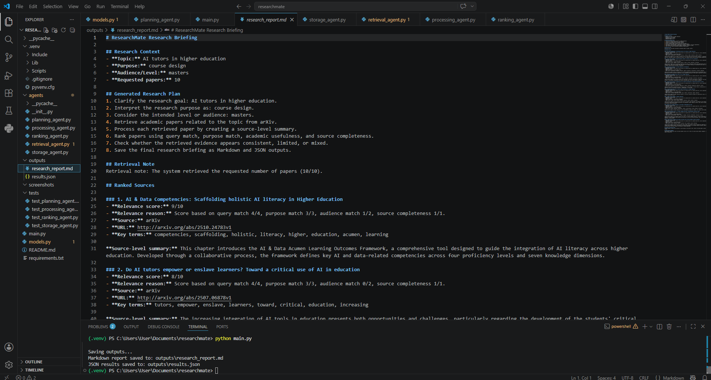
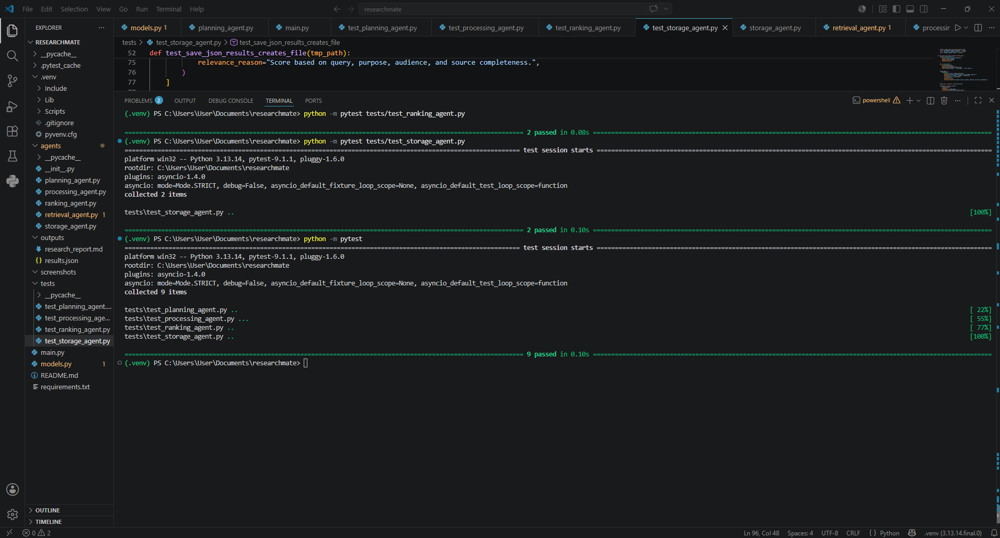

# ResearchMate

ResearchMate is a prototype academic research planning agent. It receives a user-defined research topic, purpose, audience level, and desired number of papers. It then creates a research plan, retrieves academic papers from arXiv, processes the retrieved abstracts, ranks the papers by relevance, assesses the strength of the retrieved evidence, and saves the final output as both Markdown and JSON.

This implementation is based on the earlier ResearchMate design proposal, but it simplifies the infrastructure to keep the system reproducible, testable, and suitable for individual demonstration.

## Screenshots

### Execution Evidence



### Test Results



## Project Purpose

The purpose of ResearchMate is to support structured academic research and information gathering. The system is designed to demonstrate autonomous agent behaviour by completing the following sequence:

1. Receive a research goal from the user.
2. Interpret the user's research purpose and audience level.
3. Generate an ordered research plan.
4. Retrieve academic papers from arXiv.
5. Process retrieved papers into source-level summaries.
6. Rank papers according to relevance.
7. Assess whether the retrieved evidence is strong, limited, or mixed.
8. Save the final research briefing.

## Implemented Agent Structure

The prototype uses a modular multi-agent structure.

### Planning Agent

The Planning Agent creates an ordered research plan based on the user's topic, purpose, audience level, and requested number of papers.

### Retrieval Agent

The Retrieval Agent searches arXiv for academic papers. arXiv was selected because it provides free academic metadata without requiring an API key. The Retrieval Agent also includes error handling. If arXiv is unavailable or returns an error, the system uses clearly labelled fallback records so the rest of the pipeline can still be demonstrated and tested.

### Processing Agent

The Processing Agent creates source-level summaries from retrieved abstracts and extracts key terms. The summaries are kept separate by source to avoid merging different papers into unsupported combined claims.

### Ranking Agent

The Ranking Agent scores papers out of 10. The score is based on:

* Query match: up to 4 points
* Research purpose match: up to 3 points
* Audience or level match: up to 2 points
* Source completeness: up to 1 point

This makes the ranking logic transparent and explainable.

### Storage Agent

The Storage Agent saves the final output in two formats:

* `outputs/research_report.md`
* `outputs/results.json`

Markdown is used for a readable research briefing. JSON is used for structured output and easier inspection.

## Design Refinements

The implementation includes refinements based on feedback from the earlier proposal.

First, the system uses central orchestration through `main.py`. Specialist agents do not directly control one another. Each agent returns structured output to the main controller before the next step is triggered.

Second, the system includes an evidence consistency note. It does not claim to automatically resolve conflicting academic evidence. Instead, it preserves source-level summaries and flags whether the retrieved evidence appears strong, limited, mixed, or in need of human review.

Third, Pydantic is used for structural validation only. It checks that agent outputs contain the expected fields and data types. It is not treated as a factual verification tool. Factual reliability is supported through academic source retrieval, source URLs, relevance scoring, evidence notes, and human review.

## Project Structure

```text
researchmate/
│
├── agents/
│   ├── __init__.py
│   ├── planning_agent.py
│   ├── retrieval_agent.py
│   ├── processing_agent.py
│   ├── ranking_agent.py
│   └── storage_agent.py
│
├── outputs/
│   ├── research_report.md
│   └── results.json
│
├── screenshots/
│   ├── execution_saved_outputs.png
│   └── test_results.png
│
├── tests/
│   ├── test_planning_agent.py
│   ├── test_processing_agent.py
│   ├── test_ranking_agent.py
│   └── test_storage_agent.py
│
├── main.py
├── models.py
├── README.md
└── requirements.txt
```

## Requirements

This project uses Python and the packages listed in `requirements.txt`.

Main dependencies include:

* `arxiv`
* `pydantic`
* `pytest`
* `pytest-asyncio`
* `requests`
* `python-dotenv`

## Installation

Create and activate a virtual environment.

```powershell
python -m venv .venv
.venv\Scripts\activate
```

Install the required packages.

```powershell
python -m pip install -r requirements.txt
```

## How to Run the Application

Run the main application from the project root folder.

```powershell
python main.py
```

The system will ask for:

1. Academic research topic
2. Research purpose
3. Intended level or audience
4. Number of papers to retrieve

Example input:

```text
Enter your academic research topic: AI tutors in higher education
Purpose: course design
Level/audience: masters
How many papers should be retrieved? 10
```

The system will then generate a research plan, retrieve papers, process and rank results, create an evidence note, and save output files.

## Output Files

After running the application, the output files are saved in the `outputs` folder.

```text
outputs/research_report.md
outputs/results.json
```

The Markdown report contains the readable research briefing. The JSON file contains structured data that can be inspected or reused.

## How to Run Tests

Run the full test suite with:

```powershell
python -m pytest
```

The current test suite covers:

* Planning Agent
* Processing Agent
* Ranking Agent
* Storage Agent

The tests check that plans are generated, abstracts are processed, papers are ranked, evidence notes are created, and output files are saved correctly.

## Evidence of Execution and Testing

Screenshots are stored in the `screenshots` folder.

Recommended evidence files include:

```text
screenshots/execution_saved_outputs.png
screenshots/test_results.png
```

These screenshots show that the application runs successfully, saves outputs, and passes the test suite.

## Limitations

This is a working prototype rather than a full production system.

Current limitations include:

* arXiv is the only live academic retrieval source.
* Ranking is based on transparent keyword matching rather than embeddings or full semantic similarity.
* The system processes abstracts rather than full-text papers.
* The system does not make factual truth claims or replace human academic judgement.
* If arXiv is unavailable, fallback records are used only to demonstrate that the rest of the system pipeline still works.

## Future Improvements

Future versions could add:

* Semantic Scholar and OpenAlex retrieval
* LLM-based planning through Groq or another provider
* Full-text PDF parsing
* Embedding-based ranking
* ChromaDB vector storage
* SQLite persistence
* A Chainlit or Streamlit user interface
* More advanced conflict detection between sources

## Academic Integrity and Acknowledgements

This project uses external open-source Python libraries and the arXiv public API. These tools should be acknowledged in the final submission. Any academic claims produced by the system should be checked against the original papers before being used in formal academic work.

ResearchMate is intended to support academic research organisation, not to replace independent analysis, source evaluation, or proper referencing.
